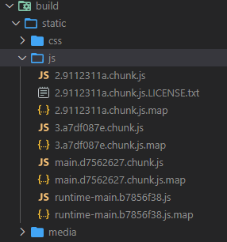

# create-react-appをejectせず、簡単にwebpack.config.jsを書き換える方法

## はじめに

* 訳あって、build時に生成されるsource mapを`inline`に変更したい
  * cordovaの実機(Andoroid)デバッグで、TypeScriptのソースにブレークポイントを設定してデバッグしたい
* でもejectしたくない

素直にejectすればよいのですが、何かいい方法がないかと検索したところ、


[rewire](https://github.com/jhnns/rewire) を使うととても簡単に書き換えが出来ることがわかりました。


  *[rewire](https://github.com/jhnns/rewire)は、対象のモジュールに特殊なgetter、setterを追加することで、公開されていない変数、関数を取得したり、モジュールにmockを挿入することができるライブラリです。*


## 前提

create-react-appで作成したプログラム(--template typescript)

## 手順

production buildを行う際、source mapを`inline'(jsソース自体に埋め込む)設定にします。

1. package.jsonの`devDependencies`に`rewire`を追加

```sh
  npm i -D rewire
```

2. package.jsonの`scripts`に、ビルド用スクリプトを追加

```json
 "build-inlinemap": "node ./build.js",
```

3. プロジェクト直下に`build.js`を作成し、下記内容を記載する。
```javascript
const rewire = require('rewire');
const defaults = rewire('react-scripts/scripts/build.js');
const config = defaults.__get__('config');

config.devtool = 'inline-source-map';
```

ビルドスクリプトから`config`オブジェクトを取り出して、`devtool`プロパティーを上書きします。

4. ビルドを行い結果を確認
```
npm run build-inlinemap
```

`～.js.map` ファイルが生成されません。


* build\static\js\main.d7562627.chunk

  sourcemapがファイルの最後に追加(inline-source-map)されていることがわかります。

```javascript
(this["webpackJsonpreact-change-conf-without-eject"]=this["webpackJsonpreact-change-conf-without-eject"]||[]).push([[0],{11:function(e,t,c){"use strict";c.r(t);var n=c(1),r=c.n(n),a=c(3),s=c.n(a),o=(c(8),c.p+"static/media/logo.6ce24c58.svg"),i=(c(9),c(0));var l=function(){return Object(i.jsx)("div",{className:"App",children:Object(i.jsxs)("header",{className:"App-header",children:[Object(i.jsx)("img",{src:o,className:"App-logo",alt:"logo"}),Object(i.jsxs)("p",{children:["Edit ",Object(i.jsx)("code",{children:"src/App.tsx"})," and save to reload."]}),Object(i.jsx)("a",{className:"App-link",href:"https://reactjs.org",target:"_blank",rel:"noopener noreferrer",children:"Learn React"})]})})},d=function(e){e&&e instanceof Function&&c.e(3).then(c.bind(null,12)).then((function(t){var c=t.getCLS,n=t.getFID,r=t.getFCP,a=t.getLCP,s=t.getTTFB;c(e),n(e),r(e),a(e),s(e)}))};s.a.render(Object(i.jsx)(r.a.StrictMode,{children:Object(i.jsx)(l,{})}),document.getElementById("root")),d()},8:function(e,t,c){},9:function(e,t,c){}},[[11,1,2]]]);
//# sourceMappingURL=data:application/json;charset=utf-8;base64,eyJ2ZXJzaW9uIjozLCJzb3VyY2VzIjpbImxvZ28uc3ZnIiwiQXBwLnRzeCIsInJlcG9ydFdlYlZpdGFscy50cyIsImluZGV4LnRzeCJdLCJuYW1lcyI6WyJBcHAiLCJjbGFzc05hbWUiLCJzcmMiLCJsb2dvIiwiYWx0IiwiaHJlZiIs
～～～省略～～～
```

*※ 通常のbuildを行った場合*

`～.js.map` ファイルが生成されます。




sourcemapを生成したくない場合は、環境変数で指定します。
```
GENERATE_SOURCEMAP=false
```

## 参考にしたページ

プロダクションビルドで、コンポーネント名の省略(mangling)を無効にするために
[rewire](https://github.com/jhnns/rewire)を利用しています。


https://marmelab.com/blog/2021/07/22/cra-webpack-no-eject.html
